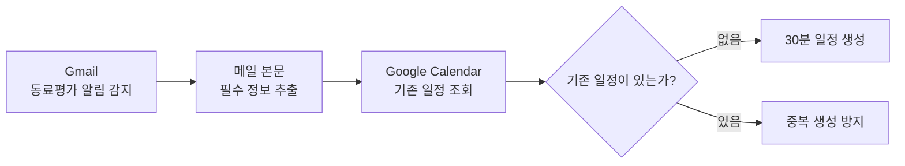
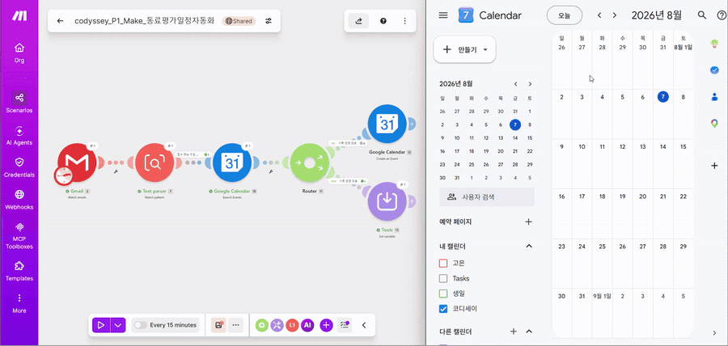
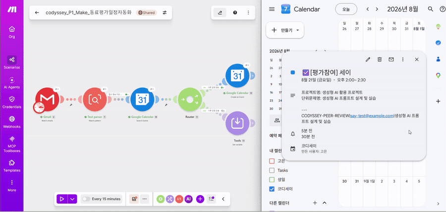
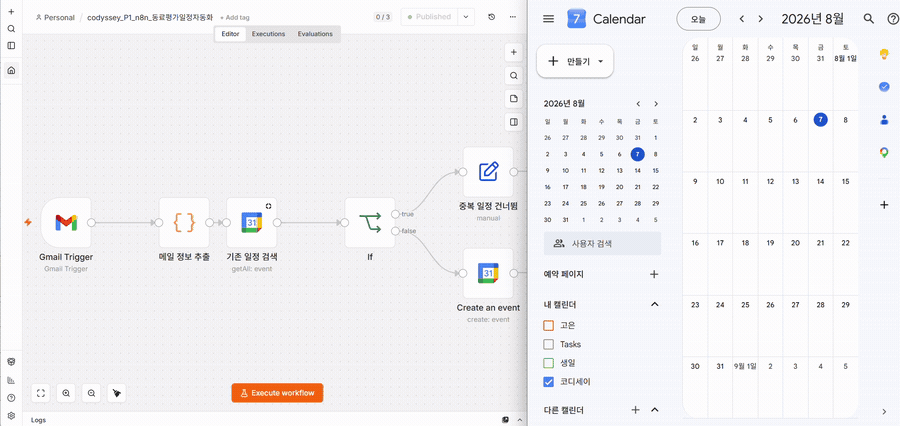
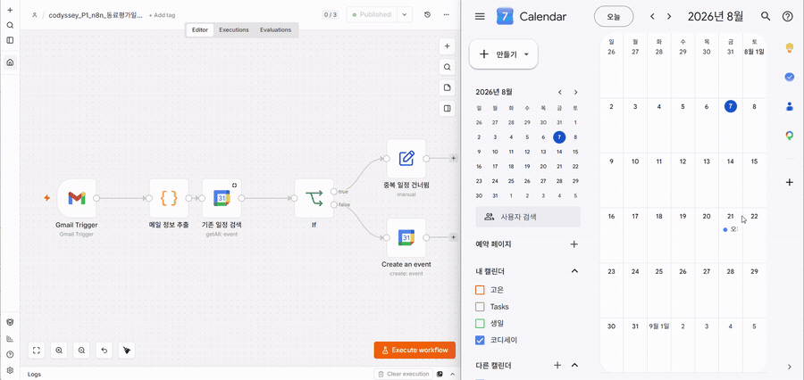
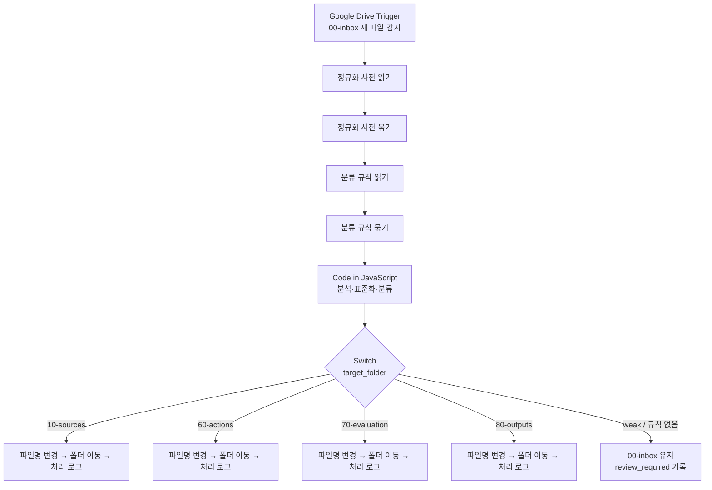
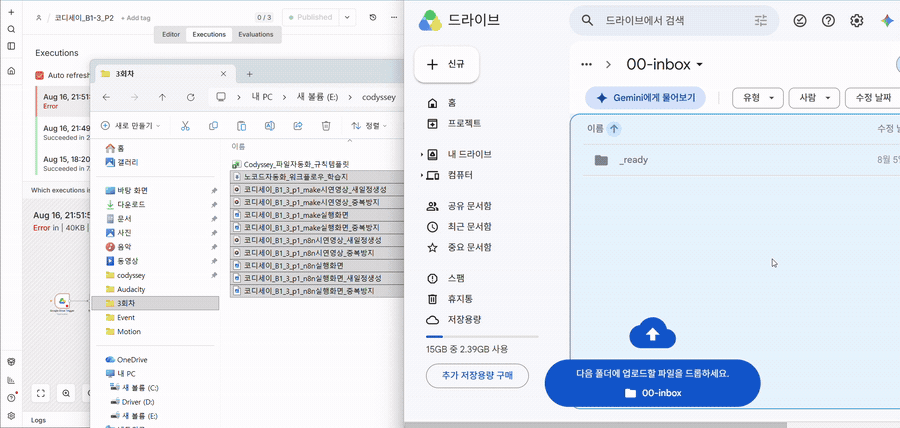
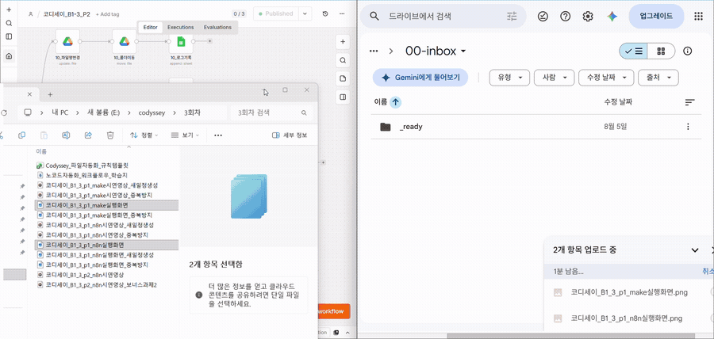
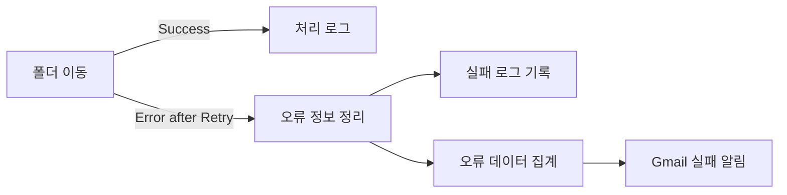

# No-Code Automation Workflow

> **Codyssey B1-3 · 노코드 자동화 기초**  
> 동일한 동료평가 일정 등록 업무를 Make와 n8n으로 비교 구현하고, Google Drive에 쌓이는 프로젝트 자산을 규칙에 따라 정리하는 파일 운영 자동화를 설계·검증했습니다.

<p align="center">
  
  
  
  
</p>

## Summary

| 구분 | 프로젝트 1 | 프로젝트 2 |
|---|---|---|
| 해결한 문제 | 동료평가 알림 메일을 확인하고 Calendar에 옮기는 반복 업무 | 프로젝트 파일의 이름과 저장 위치가 제각각인 문제 |
| 구현 내용 | Gmail → 정보 추출 → 기존 일정 확인 → 신규 생성 / 중복 방지 | Drive Inbox → 파일명 정규화 → 규칙 기반 분류 → 이동 → 로그 |
| 사용 도구 | Make, n8n | n8n self-hosted |
| 조건 분기 | 신규 일정 / 기존 일정 | 4개 레이어 / `review_required` fallback |
| 실행 결과 | 두 도구에서 신규 생성과 중복 방지 경로 검증 | 자동 분류·로그와 보너스 2 실패 대응 검증 |
| 보너스 | — | Retry, 실패 로그, Gmail Alert |

### 바로가기

- [프로젝트 1 Make 공개 워크플로우](https://eu1.make.com/public/shared-scenario/lpiUJmzVMvI/codyssey-p1-make-%EB%8F%99%EB%A3%8C%ED%8F%89%EA%B0%80%EC%9D%BC%EC%A0%95%EC%9E%90%EB%8F%99%ED%99%94)
- [프로젝트 1 n8n Workflow JSON](workflows/코디세이_B1-3_P1_n8n구조_동료평가일정자동화_masked.json)
- [프로젝트 2 n8n Workflow JSON](workflows/코디세이_B1-3_P2_n8n구조_구글드라이브파일정리자동화_masked.json)
- [공식 미션 요구사항 체크리스트](#공식-미션-요구사항-체크리스트)

---

## Overview

이 프로젝트는 노코드·로우코드 자동화 도구를 단순히 연결하는 데서 끝나지 않고, 반복 업무의 Trigger와 Action을 정의하고 조건 분기, 실행 로그, 실패 경로까지 설계하는 것을 목표로 했습니다.

### What I Built

1. **프로젝트 1 — Make vs n8n**  
   동일한 Gmail 기반 동료평가 일정 등록 업무를 두 도구에서 구현하고 설계 방식과 사용 경험을 비교했습니다.
2. **프로젝트 2 — Google Drive File Automation**  
   `00-inbox`를 진입점으로 파일명 정규화, 규칙 기반 분류, 폴더 이동, 처리 로그, 실패 알림까지 포함한 파일 운영 자동화를 만들었습니다.

### Tech / Tools

| 영역 | 사용 기술 |
|---|---|
| Automation | Make, n8n |
| Runtime | Windows, Docker Desktop, n8n self-hosted |
| Integrations | Gmail, Google Calendar, Google Drive, Google Sheets |
| Logic | Filter, Router, IF, Switch, Regular Expression, JavaScript Code |
| Reliability | Retry On Fail, Error Output, Aggregate, Gmail Alert |

---

# 프로젝트 1 — Make vs n8n

## Problem

Gmail로 수신되는 동료평가 알림에서 요청자, 평가일시, 프로젝트명, 단위문제명을 확인한 뒤 Google Calendar에 다시 입력하는 작업이 반복됐습니다. 같은 평가 일정이 다시 처리될 경우 중복 일정이 생길 수 있으므로 신규 생성 경로와 중복 방지 경로를 함께 설계했습니다.

## Input & Output

| 구분 | 내용 |
|---|---|
| Trigger 대상 | 특정 제목의 Gmail 동료평가 알림 |
| 추출 정보 | 요청자명, 요청자 이메일, 평가예정일시, 프로젝트명, 단위문제명 |
| 일정 제목 | `☑️[평가참여] {요청자명}` |
| 일정 시간 | 평가예정일시부터 30분 |
| Description | 프로젝트명, 단위문제명 |
| 중복 처리 | 기존 일정이 있으면 새 일정을 만들지 않음 |

## Common Workflow



Make와 n8n에서 모듈·노드 구성 방식은 달랐지만, **감지 → 추출 → 조회 → 조건 분기 → 생성/스킵**이라는 업무 논리는 동일하게 유지했습니다.

## Workflow & Demo

| 도구 | 구현 자료 |
|---|---|
| Make | [공개 시나리오 보기](https://eu1.make.com/public/shared-scenario/lpiUJmzVMvI/codyssey-p1-make-%EB%8F%99%EB%A3%8C%ED%8F%89%EA%B0%80%EC%9D%BC%EC%A0%95%EC%9E%90%EB%8F%99%ED%99%94) |
| n8n | [마스킹된 Workflow JSON 보기](workflows/코디세이_B1-3_P1_n8n구조_동료평가일정자동화_masked.json) |

> 본 n8n 워크플로우는 로컬 Docker 환경에서 구현하여 외부 공개 URL은 제공하지 않습니다. 대신 마스킹된 Workflow JSON과 실행 시연을 제공합니다.

### Make 실행 결과

#### 신규 일정 생성

[](assets/gifs-large/코디세이_B1_3_p1_make시연영상_새일정생성_900w.gif)

#### 중복 일정 방지

[](assets/gifs-large/코디세이_B1_3_p1_make시연영상_중복방지_900w.gif)

### n8n 실행 결과

#### 신규 일정 생성

[](assets/gifs-large/코디세이_B1_3_p1_n8n시연영상_새일정생성_900w.gif)

#### 중복 일정 방지

[](assets/gifs-large/코디세이_B1_3_p1_n8n시연영상_중복방지_900w.gif)

## Make 구현

| 순번 | 단계 | 역할 |
|---:|---|---|
| 1 | Gmail — Watch New Emails | 동료평가 알림 메일 감지 |
| 2 | Gmail 검색 조건 | `subject:"동료평가자로 지정 되었습니다."`에 해당하는 메일 선별 |
| 3 | Text Parser / Regular Expression | 본문에서 일정 생성에 필요한 5개 필드 추출 |
| 4 | Filter / Calendar 조회 | 추출 결과를 확인하고 기존 일정 존재 여부에 따라 경로 분기 |
| 5 | Google Calendar | 신규 경로에서 30분 일정 생성, 기존 일정은 중복 생성 방지 |

<details>
<summary><strong>Make 정규식과 Parser 설정</strong></summary>

```regex
요청자\s*:\s*([^\r\n(]+)\s*\(([^)\r\n]+)\).*?평가예정일시\s*:\s*([0-9]{4}-[0-9]{2}-[0-9]{2}\s+[0-9]{2}:[0-9]{2}:[0-9]{2}).*?프로젝트명\s*:\s*([^\r\n]+).*?단위문제명\s*:\s*([^\r\n]+)
```

| Capture | 추출 값 |
|---|---|
| `$1` | 요청자명 |
| `$2` | 요청자 이메일 |
| `$3` | 평가예정일시 |
| `$4` | 프로젝트명 |
| `$5` | 단위문제명 |

Parser 설정은 `Global: false`, `Case sensitive: false`, `Multiline: true`, `Singleline: true`를 사용했습니다.

</details>

### Implementation Note

Named Capture Group을 사용했을 때 metadata parsing 오류가 발생했습니다. 필요한 값을 unnamed capture group의 `$1`~`$5`로 매핑하는 방식으로 변경해 파싱을 정상화했습니다.

## n8n 구현

| 순번 | 실제 노드 | 역할 |
|---:|---|---|
| 1 | Gmail Trigger | 새 동료평가 알림 감지 |
| 2 | 메일 정보 추출 | Code 노드의 정규식으로 필수 정보 추출. 매칭 실패 시 오류 발생 |
| 3 | 기존 일정 검색 | Calendar에서 중복 판정 대상 조회 |
| 4 | If | 조회 결과에 따라 기존 일정 / 신규 일정 분기 |
| 5 | 중복 일정 건너뜀 | 기존 일정 경로에서 새 일정 생성 없이 종료 |
| 6 | Create an event | 신규 경로에서 30분 일정 생성 |

## Make vs n8n 비교

아래 비교는 이 프로젝트를 직접 구현하며 확인한 경험을 기준으로 작성했습니다. 변동될 수 있는 요금제 수치나 확인하지 않은 성능 수치는 포함하지 않았습니다.

| 비교 항목 | Make | n8n |
|---|---|---|
| UI / UX | 시나리오가 캔버스에 시각적으로 표현돼 처음에도 흐름을 파악하기 쉬웠음 | 노드와 JSON 데이터를 함께 확인해 처리 과정을 세밀하게 추적하기 좋았음 |
| 초기 설정 | SaaS 환경에서 빠르게 시작할 수 있었음 | Docker 실행 환경과 Google OAuth 연결 과정이 추가로 필요했음 |
| 흐름 파악 | 모듈과 연결선 중심이라 전체 시나리오를 한눈에 보기 편리했음 | 복잡한 노드가 많아져도 실행 데이터와 함께 원인을 추적하기 좋았음 |
| 데이터 매핑 | 이전 모듈 값을 시각적 매핑 패널에서 선택 | Expression과 노드별 JSON을 이용해 값을 참조 |
| 조건 분기 | Router와 경로별 Filter로 표현 | IF·Switch 노드의 출력으로 표현 |
| 정규식 처리 | Text Parser 설정으로 빠르게 구성 | Code 노드에서 정규식과 예외 처리를 직접 제어 |
| 실행 로그 | 실행 결과의 모듈별 입·출력을 시각적으로 확인 | Executions에서 노드별 입력·출력 JSON과 오류를 확인 |
| 디버깅 | 모듈 단위 데이터 확인이 직관적 | 실패 노드의 원본 데이터와 Expression을 세밀하게 검사 가능 |
| 데이터 통제 | Make의 관리형 실행 환경을 사용 | 로컬 self-hosted 환경에서 실행 데이터와 운영 환경을 직접 관리 |
| 확장성 | 표준 커넥터 기반 업무 자동화를 빠르게 확장하기 좋음 | Code, API, 복잡한 분기와 후속 자동화로 확장하기 유리 |
| 초보자 접근성 | 시각적 구조와 기본 모듈 중심이라 비교적 접근하기 쉬웠음 | 데이터 구조와 자체 실행 환경에 대한 추가 학습이 필요했음 |

### 장단점과 선택 기준

| 도구 | 장점 | 단점 | 적합한 상황 |
|---|---|---|---|
| Make | 빠른 시작, 직관적인 시나리오, 쉬운 흐름 파악 | 복잡한 데이터 가공이 늘어나면 매핑과 수식 관리가 어려워질 수 있음 | 빠른 프로토타입, 비개발자 중심 협업, 관리 부담을 줄이고 싶은 경우 |
| n8n | 세밀한 데이터 제어, Code 노드, 상세 로그, self-hosting | 초기 환경 구성과 JSON·Expression 이해에 학습이 필요함 | 복잡한 분기, 자체 운영, API·AI 연동 등 후속 확장이 필요한 경우 |

두 도구 사이에 절대적인 우열이 있다기보다, **빠른 구축과 접근성은 Make**, **세밀한 제어와 자체 운영·확장성은 n8n**이 더 잘 맞았습니다.

---

# 프로젝트 2 — Google Drive File Automation

## Problem

프로젝트를 진행하면서 캡처 이미지, 시연영상, 보고서, 학습자료가 계속 쌓였습니다. 파일명과 저장 위치가 일정하지 않으면 필요한 자료를 다시 찾기 어렵고, 이름 변경·폴더 이동·처리 기록을 매번 수동으로 반복해야 했습니다.

이를 해결하기 위해 Google Drive의 `00-inbox`를 단일 진입점으로 사용하고, 파일명 정규화·규칙 기반 분류·폴더 이동·처리 로그·실패 알림까지 포함한 파일 운영 자동화를 설계했습니다.

## Why n8n

- Windows의 Docker Desktop에서 self-hosted로 실행 가능
- Google Drive, Google Sheets, Gmail 연동 가능
- Switch와 Error Output을 이용한 다중 분기와 실패 경로 구성
- Code 노드를 이용한 파일명 분석과 표준 파일명 생성
- 규칙이 늘어나더라도 Google Sheet와 Code 로직으로 확장 가능

> 현재 프로젝트는 생성형 AI Action을 사용하지 않은 **규칙 기반 분류**입니다. AI 보조 분류는 향후 개선 방향으로만 다룹니다.

## Execution Environment

| 항목 | 환경 |
|---|---|
| OS | Windows |
| Runtime | Docker Desktop |
| Automation | n8n self-hosted, localhost 실행 |
| Integrations | Google Drive, Google Sheets, Gmail |
| 외부 공개 방식 | localhost URL이 아닌 마스킹된 Workflow JSON과 GIF 제공 |

## Google Drive Structure

자료는 **프로젝트 → 레이어**가 아니라 **레이어 → 프로젝트** 순서로 관리합니다.

```text
Google Drive/
├─ 00-inbox/
│  └─ 코디세이/
├─ 10-sources/
│  └─ 코디세이/
├─ 60-actions/
│  └─ 코디세이/
├─ 70-evaluation/
│  └─ 코디세이/
├─ 80-outputs/
│  └─ 코디세이/
└─ 90-automation/
   └─ 코디세이_파일자동화_규칙관리
```

`90-automation`에는 파일명 정규화 사전, 분류 규칙, 처리 로그, 실패 로그를 관리하는 Google Sheet를 둡니다.

## Architecture



## Workflow & Demo

[마스킹된 프로젝트 2 n8n Workflow JSON 보기](workflows/코디세이_B1-3_P2_n8n구조_구글드라이브파일정리자동화_masked.json)

### 기본 파일 분류·정리

[](assets/gifs-large/코디세이_B1_3_p2_n8n시연영상_900w.gif)

### 보너스 2 · Retry와 실패 알림

[](assets/gifs-large/코디세이_B1_3_p2_n8n시연영상_보너스과제2_900w.gif)

## 구현 단계

| 순번 | 단계 | 역할 |
|---:|---|---|
| 1 | Google Drive Trigger | `00-inbox`의 새 파일을 감지해 수동 개입 없이 실행 |
| 2 | 정규화 사전 읽기·묶기 | 다양한 파일명 표현을 표준값으로 변환할 사전 준비 |
| 3 | 분류 규칙 읽기·묶기 | keyword, strength, priority, target folder 규칙 준비 |
| 4 | Code in JavaScript | 파일명 분석, 표준 파일명 생성, 분류 규칙 매칭 |
| 5 | Switch | `target_folder`에 따라 4개 레이어와 검토 필요 경로로 분기 |
| 6 | 파일명 변경 | 규칙에 따라 생성한 표준 파일명으로 변경 |
| 7 | 폴더 이동 | 해당 레이어 아래의 프로젝트 폴더로 이동 |
| 8 | 처리 로그 | 원본명, 변경명, 매칭 규칙, 상태 등을 기록 |
| 9 | 실패 처리 | 폴더 이동 재시도 후 최종 실패를 Error Output으로 전달 |
| 10 | 실패 로그·Gmail | 실패 정보 기록, 오류 집계, 관리자 알림 |

## 파일명 표준화

표준화의 목적은 이름 자체를 예쁘게 만드는 것이 아니라, 프로젝트 자산을 일관되게 검색하고 관리할 수 있도록 만드는 것입니다.

```text
프로젝트_미션_P번호_문서유형_도구_주제_버전_YYMMDD.확장자
```

없는 항목은 억지로 만들지 않고 생략합니다.

| 요소 | 처리 규칙 |
|---|---|
| 프로젝트 | 현재 프로젝트는 `코디세이`로 정규화 |
| 미션 | `B1-3`처럼 표준 형식으로 변환 |
| P번호 | P1 / P2 추출 |
| 문서유형·도구·주제 | 각각 별도 필드로 분석·표준화 |
| 버전 | `v1`, `v2` 등은 유지하고 `최종`, `최종본`, `완성본`은 `ff`로 변환 |
| 날짜 | 파일명 날짜를 우선 사용하고, 없으면 Drive 생성일 사용 |
| 확장자 | 원본 확장자 보존 |

예시:

```text
코디세이_B1-3_P1_시연영상_Make_새일정생성_260817.mp4
코디세이_B1-3_P1_실행화면_n8n_중복방지_260817.png
```

## Rule Management in Google Sheets

Google Sheet `코디세이_파일자동화_규칙관리`에 규칙과 실행 결과를 분리해 관리했습니다. 워크플로우를 직접 수정하지 않고도 규칙 데이터를 확인·보완하기 위한 구조입니다.

| Sheet | 역할 | 핵심 데이터 |
|---|---|---|
| `정규화_사전` | 다양한 표현을 표준값으로 치환 | 입력 표현, 표준값 |
| `분류_규칙` | 파일의 목적 폴더 결정 | keyword, strength, priority, target folder |
| `처리_로그` | 정상 처리 및 검토 필요 결과 기록 | 처리 시각, 원본명, 변경명, 감지 정보, 대상 폴더, 매칭 규칙, 상태 |
| `실패_로그` | 이동 실패 정보 기록 | 실패 시각, 파일 정보, 실패 노드, 오류 메시지, 대상 폴더, 상태 |

`처리_로그`에는 미션, 문서유형, 주제, 버전, 날짜 출처, P번호, 도구 등 분석 결과도 함께 남겨 추적 가능성을 높였습니다.

## Classification & Fallback

분류 규칙은 **strong / weak** 개념으로 자동화의 확신 수준을 구분합니다.

| 판단 결과 | 처리 방식 |
|---|---|
| Strong 규칙 | 우선순위에 따라 목적 폴더를 선택하고 자동 이동 |
| Weak 규칙만 존재 | 자동 이동하지 않고 `00-inbox` 유지, `review_required` 기록 |
| 일치 규칙 없음 | `00-inbox` 유지, 사람이 검토 |

예를 들어 `시연영상`은 `80-outputs`, `실행화면`은 `60-actions`로 분류합니다. 핵심은 분류 성공률을 과장하는 것이 아니라, **불확실한 자동 판단을 강제로 실행하지 않는 fallback**을 둔 점입니다.

<details>
<summary><strong>Code 노드의 핵심 처리 역할</strong></summary>

- 파일명 분석과 확장자 추출
- 미션 번호와 P번호 정규화
- 날짜·버전·문서유형·도구명·주제 추출
- 분류 규칙 매칭과 `target_folder` 결정
- 표준 파일명과 처리 상태 생성

전체 구현은 [마스킹된 Workflow JSON](workflows/코디세이_B1-3_P2_n8n구조_구글드라이브파일정리자동화_masked.json)에서 확인할 수 있습니다.

</details>

## Failure Handling & Retry

10 / 60 / 70 / 80 각 폴더 이동 노드에 동일한 실패 대응 구조를 적용했습니다.



- `Retry On Fail` 활성화, 최대 3회 시도
- 재시도 후에도 실패하면 Error Output으로 전달
- 실패 파일, 실패 노드, 오류 메시지, 대상 폴더, 발생 시각 기록
- Gmail에 오류 파일 수, 파일명, 실패 노드, 발생 시각, 실패 로그 확인 경로 제공

이 구조는 모든 오류를 자동 복구한다고 주장하는 것이 아니라, 일시적 실패에는 재시도하고 최종 실패는 기록과 알림으로 사람이 확인할 수 있게 만든 대응 전략입니다.

---

# Testing

조건 분기의 각 경로가 최소 한 번 이상 실행되는지 확인할 수 있도록 정상·중복·fallback·실패 시나리오를 나눠 테스트했습니다.

## 프로젝트 1

| ID | 도구 | 시나리오 | 기대 결과 | 확인 |
|---|---|---|---|---|
| P1-01 | Make | 신규 동료평가 알림 | Calendar에 30분 일정 생성 | ✅ |
| P1-02 | Make | 기존 일정이 있는 알림 | 중복 일정 미생성 | ✅ |
| P1-03 | n8n | 신규 동료평가 알림 | Calendar에 30분 일정 생성 | ✅ |
| P1-04 | n8n | 기존 일정이 있는 알림 | 중복 일정 미생성 | ✅ |

## 프로젝트 2

| ID | 시나리오 | 기대 결과 | 확인 |
|---|---|---|---|
| P2-01 | Strong 규칙과 일치하는 파일 업로드 | 파일명 표준화 후 대상 폴더 이동 | ✅ |
| P2-02 | 날짜·버전 등이 포함된 파일 업로드 | 분석 정보가 반영된 표준 파일명 생성 | ✅ |
| P2-03 | 10 / 60 / 70 / 80 분류 대상 입력 | 각 분기 실행 및 처리 로그 기록 | ✅ |
| P2-04 | Weak 규칙만 존재하거나 규칙 없음 | `00-inbox` 유지, `review_required` 기록 | ✅ |
| P2-05 | 테스트용 잘못된 File ID | 폴더 이동 재시도 | ✅ |
| P2-06 | 재시도 후 최종 실패 | 실패 로그 기록 | ✅ |
| P2-07 | 최종 실패 알림 | Gmail 실패 알림 발송 | ✅ |
| P2-08 | 테스트 설정 원복 후 새 파일 | 정상 경로 재실행 | ✅ |

---

# 공식 미션 요구사항 체크리스트

| 요구사항 | 프로젝트 | 구현 내용 | 상태 |
|---|---|---|:---:|
| 실제 동작하는 워크플로우 | 공통 | Make·n8n 실행 결과와 GIF 제공 | ✅ |
| Trigger 1개 이상 | P1 | Gmail Trigger | ✅ |
| Action 2개 이상 | P1 | 정보 추출, 일정 조회, Calendar 생성 | ✅ |
| 조건 분기 | P1 | 신규 일정 / 중복 방지 | ✅ |
| 각 분기 실행 검증 | P1 | Make·n8n 신규/중복 시연 | ✅ |
| 2개 이상 도구 | P1 | Make, n8n | ✅ |
| 동일 워크플로우 구조 | P1 | Gmail → 추출 → 조회 → 생성/스킵 | ✅ |
| 비교 항목 5개 이상 | P1 | 실제 구현 경험 기반 11개 항목 | ✅ |
| 장단점·적합 상황 | P1 | 도구별 장점, 단점, 선택 기준 정리 | ✅ |
| Trigger 자동 실행 | P2 | Google Drive Trigger | ✅ |
| Action 2개 이상 | P2 | 파일명 변경, 폴더 이동, 로그 기록 | ✅ |
| 조건 분기 | P2 | Switch의 4개 레이어와 fallback | ✅ |
| 각 분기 실행 검증 | P2 | 폴더별 실행 및 `review_required` 결과 | ✅ |
| 반복 업무·도구 선정 이유 | P2 | 문제 정의와 n8n 선정 근거 작성 | ✅ |
| 자동 실행 흐름 설명 | P2 | Mermaid와 단계별 역할 표 | ✅ |
| 실패 알림 | Bonus 2 | Gmail Alert | ✅ |
| 재시도 | Bonus 2 | Retry On Fail | ✅ |
| 민감정보 보호 | 공통 | 공개용 Workflow JSON 마스킹 | ✅ |

> 보너스 1의 생성형 AI Action은 구현 범위에 포함하지 않았습니다.

---

# Deliverables

확장자가 실제로 확인된 GIF와 JSON은 저장소 상대경로로 연결했습니다. 제공된 목록에서 확장자가 확인되지 않은 파일은 이름을 임의로 바꾸지 않았습니다.

## 프로젝트 공통 자료

| 산출물 | 위치 |
|---|---|
| `Codyssey_파일자동화_규칙템플릿` | 산출물 폴더 — GitHub 업로드 시 실제 경로 연결 |
| `노코드자동화_워크플로우_학습지` | 산출물 폴더 — GitHub 업로드 시 실제 경로 연결 |
| `README_final.md` | 현재 문서 |

## 프로젝트 1 — Make

| 산출물 | 위치 |
|---|---|
| `코디세이_B1_3_p1_make시연영상_새일정생성_900w.gif` | [GIF 보기](assets/gifs-large/코디세이_B1_3_p1_make시연영상_새일정생성_900w.gif) |
| `코디세이_B1_3_p1_make시연영상_중복방지_900w.gif` | [GIF 보기](assets/gifs-large/코디세이_B1_3_p1_make시연영상_중복방지_900w.gif) |
| `코디세이_B1_3_p1_make실행화면` | 산출물 폴더 — GitHub 업로드 시 실제 경로 연결 |
| `코디세이_B1_3_p1_make실행화면_중복방지` | 산출물 폴더 — GitHub 업로드 시 실제 경로 연결 |

## 프로젝트 1 — n8n

| 산출물 | 위치 |
|---|---|
| `코디세이_B1_3_p1_n8n시연영상_새일정생성_900w.gif` | [GIF 보기](assets/gifs-large/코디세이_B1_3_p1_n8n시연영상_새일정생성_900w.gif) |
| `코디세이_B1_3_p1_n8n시연영상_중복방지_900w.gif` | [GIF 보기](assets/gifs-large/코디세이_B1_3_p1_n8n시연영상_중복방지_900w.gif) |
| `코디세이_B1_3_p1_n8n실행화면` | 산출물 폴더 — GitHub 업로드 시 실제 경로 연결 |
| `코디세이_B1_3_p1_n8n실행화면_새일정생성` | 산출물 폴더 — GitHub 업로드 시 실제 경로 연결 |
| `코디세이_B1_3_p1_n8n실행화면_중복방지` | 산출물 폴더 — GitHub 업로드 시 실제 경로 연결 |

## 프로젝트 2 — n8n

| 산출물 | 위치 |
|---|---|
| `코디세이_B1_3_p2_n8n시연영상_900w.gif` | [GIF 보기](assets/gifs-large/코디세이_B1_3_p2_n8n시연영상_900w.gif) |
| `코디세이_B1_3_p2_n8n시연영상_보너스과제2_900w.gif` | [GIF 보기](assets/gifs-large/코디세이_B1_3_p2_n8n시연영상_보너스과제2_900w.gif) |

## 재현용 Workflow

| 산출물 | 위치 |
|---|---|
| Make P1 | [공개 시나리오](https://eu1.make.com/public/shared-scenario/lpiUJmzVMvI/codyssey-p1-make-%EB%8F%99%EB%A3%8C%ED%8F%89%EA%B0%80%EC%9D%BC%EC%A0%95%EC%9E%90%EB%8F%99%ED%99%94) |
| `코디세이_B1-3_P1_n8n구조_동료평가일정자동화_masked.json` | [JSON 보기](workflows/코디세이_B1-3_P1_n8n구조_동료평가일정자동화_masked.json) |
| `코디세이_B1-3_P2_n8n구조_구글드라이브파일정리자동화_masked.json` | [JSON 보기](workflows/코디세이_B1-3_P2_n8n구조_구글드라이브파일정리자동화_masked.json) |

---

# Security

- Make Connection과 n8n Credential의 OAuth, API Key, Token은 저장소에 포함하지 않습니다.
- 공개용 Workflow JSON에는 이메일, Drive Folder ID, Spreadsheet ID, Credential 식별자, 내부 instance 정보를 placeholder로 마스킹했습니다.
- 예시 placeholder: `your-email@example.com`, `YOUR_INBOX_FOLDER_ID`, `YOUR_SPREADSHEET_ID`, `YOUR_GOOGLE_DRIVE_CREDENTIAL_ID`.
- n8n의 localhost 주소를 공개 실행 링크처럼 제공하지 않습니다.
- 계정 정보가 보이는 캡처는 공개 전 마스킹하고, Google 문서 링크는 필요한 권한만 부여합니다.
- 테스트용 잘못된 File ID는 실패 시나리오 검증 후 정상 값으로 복원했습니다.

---

# What I Learned

- Trigger와 Action의 역할을 실제 데이터 흐름으로 구분하고 설명하는 경험
- 같은 업무도 Make의 Router·Filter와 n8n의 IF·Switch처럼 플랫폼마다 다르게 표현된다는 점
- 정규식, 실행 데이터, 노드별 로그를 이용한 파싱 오류와 매핑 문제 디버깅
- 정상 경로뿐 아니라 Retry, Error Output, 실패 로그, 알림을 함께 설계하는 방법
- 불확실한 분류를 강제로 실행하지 않고 `review_required` fallback으로 남기는 방법
- 규칙 데이터를 Google Sheet로 분리해 워크플로우 수정 부담을 줄이는 유지보수 방식
- self-hosted n8n 환경을 직접 구성하고 Google 서비스와 연결한 경험

---

# Limitations & Future Work

- 다중 파일 부분 실패 시 File ID 기반 오류 추적으로 item correlation 안정성 개선
- 공통 Error Workflow로 분기별 실패 처리 구조 단순화
- Docker 기반 로컬 실행 환경을 지속 실행 가능한 서버 환경으로 이전
- 파일 유형과 프로젝트 증가에 맞춘 규칙 관리 구조 개선
- 규칙만으로 판단하기 어려운 파일에 생성형 AI Action을 **보조 분류 수단으로** 선택 적용
- Slack·Discord 등 추가 실패 알림 채널 연동

현재 구현하지 않은 기능은 위 개선 방향에만 포함했으며, 본 프로젝트가 모든 오류를 자동 복구하거나 AI로 파일을 분류한다고 표현하지 않습니다.

---

## 한 줄 회고

> 좋은 자동화는 정상 경로를 빠르게 연결하는 것뿐 아니라, **중복·불확실성·실패를 어떻게 다룰지 명확하게 설계하는 일**이라는 점을 배웠습니다.

<!-- GitHub 업로드 전 확인: 확장자가 확인되지 않은 산출물의 실제 저장 경로를 연결하고, 이 파일을 저장소 루트의 README.md로 사용하세요. -->
